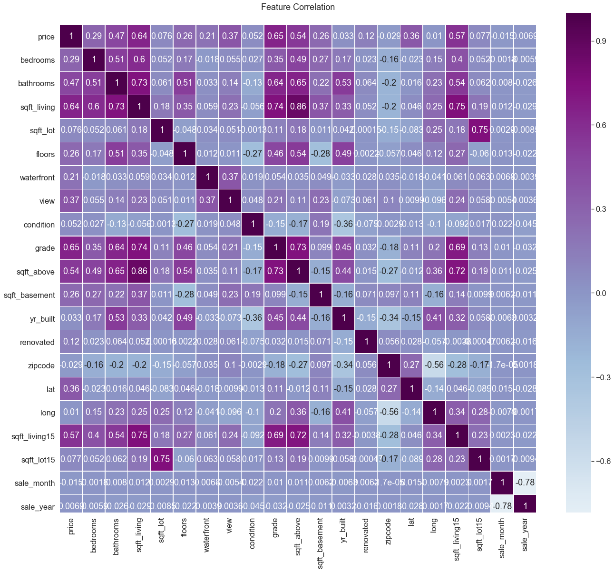
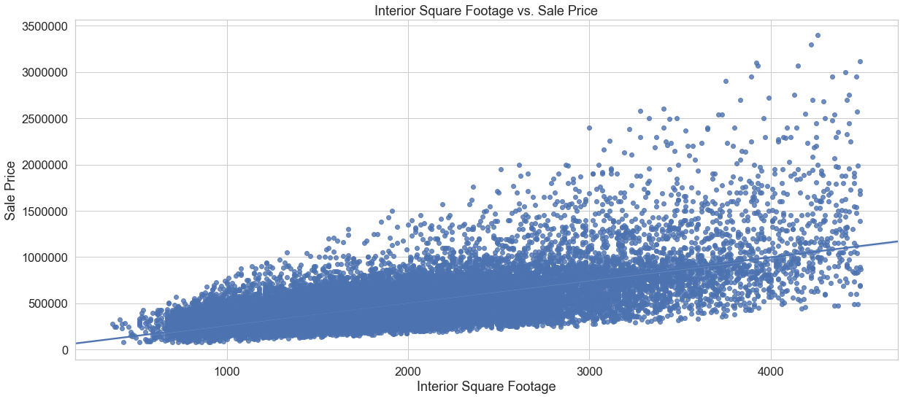
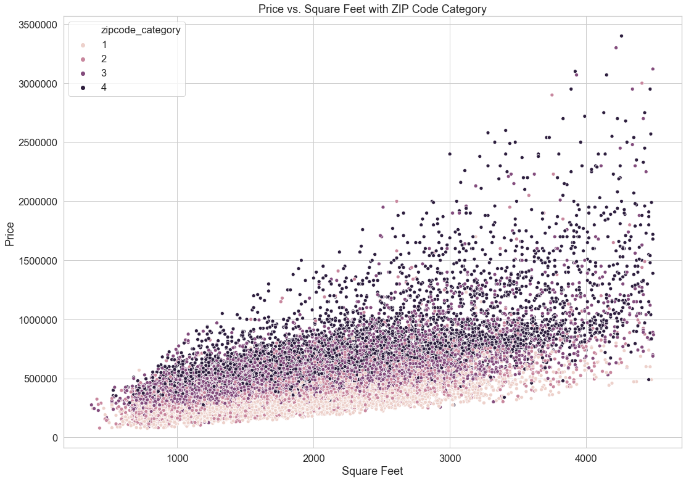
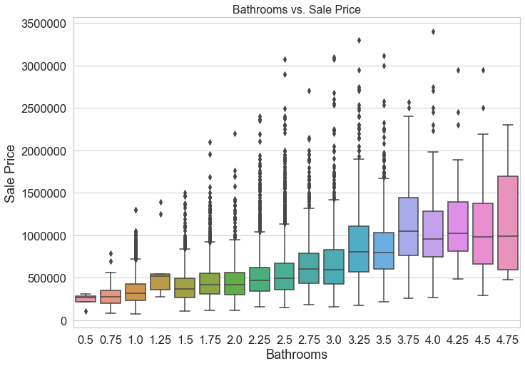
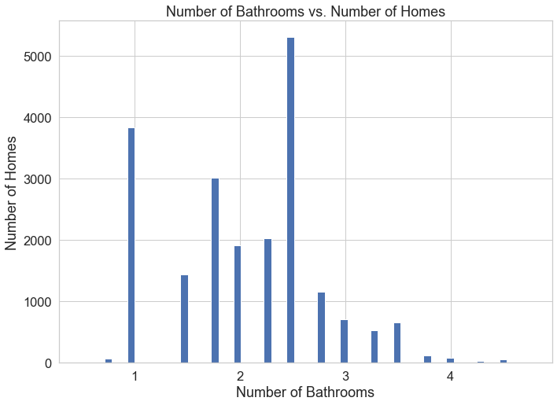

# King County Sale Prices readme

In this project, we will build a multiple linear regression model to predict sale prices for homes in King County, WA.  Using an iterative approach, we will clean, feature engineer, normalize, and model our data using an Ordinary Least Squares regression method to build the final model. 

## Dataset

We will use a sales dataset from 2014 and 2015 provided in the file 'kc_house_data.csv.' and imported as a DataFrame.

## Goals

* Interpret and clean the data provided into a useful framework for our modeling
* Feature engineer variables as needed, analyzing relationships between variables and scaling as necessary
* Iterate on our model to reduce p-values and use R-squared as a key metric
* Create training and testing sets of data used to validate our model

## Methodologies

### Importing and Cleaning

* Check for NaN values, removing and reassigning as necessary
* Using boxplots, identify and remove outliers to avoid skewing the model
* Identify continuous and categorical variables, using regplots to examine relationships to sale price

### Feature Engineering

* Change year rennovated, full date, and zipcode variables to categoricals
* Check for multicollinearity using a heatmap and drop highly correlated features
* Use boxplots to plot our categorical variables' relationships to sale price

### Normalization and Scaling

* Use distplots to examine distributions of continuous variables
* Use log transformations on continuous variables and standardize all variables
* Create dummy variables on categoricals, add to DataFrame and drop superfluous columns

### Modeling

* Iterate on model using a stepwise selection to eliminate variables with p-values greater than .05
* Create training and testing sets, calculate the mean squared error (MSE) and cross-validate over train-test split sizes
* Apply trained model to test set

## Which continuous variable is most reliable for our model?

The dataset gives us square footage of the interior living space, the lot, the area apart from the basement, the basement itself, and interior living and lot space for the nearest 15 neighbors.  Our heatmap used for checking correlations produced high values between all of these variables; we see that the regplot for interior footage is more linear and consistent and so  removed all other square footage variables.

## How can we make the best use of location using ZIP Codes?

While the dataset provides ZIP Code, latitude, and longitude information, we can engineer the ZIP Code feature to be more concrete by dividing each ZIP Code into a category from 1 to 4.  To do this we find the mean sale price of each ZIP Code grouping and split this into four quantiles, categorizing and applying back into our DataFrame.  We can now look at the square footage of interior living space compared to sale price with each ZIP Code category represented in a scatterplot to better visualize this relationship.

## Which reliable categorical variables are most common?

Several categoricals, including bedroom, view, waterfront, and condition ended up in our final model; bathroom in particular had a consistency with sale price which added some reliability.  These range from 0.5 to 4.75 with over 5,000 homes having 2.5 bathrooms with an average sale price right around $500,000.  Slightly fewer than 4,000 homes have one bathroom and are averaging under $400,000 in sale price.  Substantially fewer homes have more than 2.5 bathrooms however their mean sale price averages steadily increase as well.

